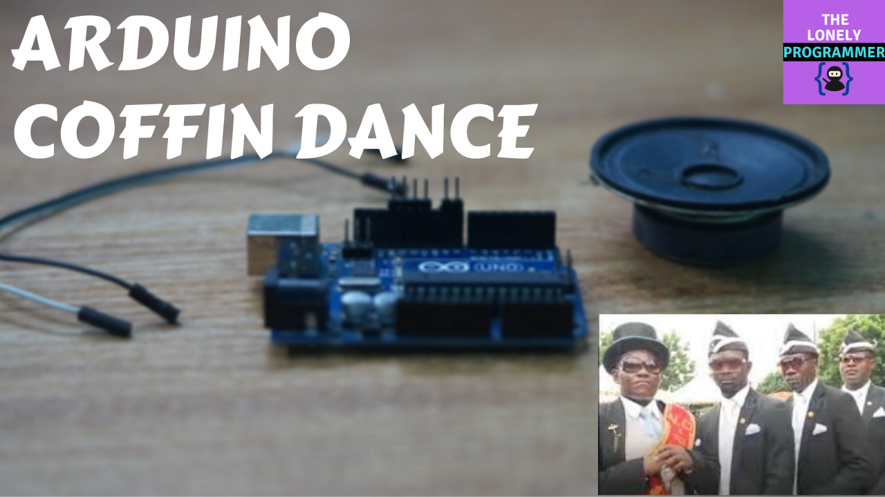

# Arduino-Coffin-Dance-Theme
In this tutorial, Let's see how to play the coffin dance theme sound on Arduino Uno

## Requirements

### Hardware

* Arduino Uno / Nano
* Piezo Buzzer or Speaker
* Jumper cables

### Software

*   Arduino IDE
*   Arduino Tone Library

## Connections

Piezo Buzzer is connected to D8 pin of Arduino Uno

| Buzzer            |  Arduino Uno  |
|-----------------------|---------------|
| Buzzer |  D8 |

## The Code

Before you play the sound, It is essential to install the Tone Arduino library if it is not already installed. This can be downloaded from Github here. If you do not know how to install third-party Arduino libraries in your version of the Arduino IDE, reference this guide on Arduino.cc. Attached below, you will find a zip file that contains the Arduino code for Arduino Coffin Theme. Download it and unzip it somewhere on your computer. Open Coffin_dance_arduino.ino in the Arduino IDE and upload the code to your Arduino.

Project Repo: https://github.com/Rahul24-06/Arduino-Coffin-Dance-Theme/

## Play Time!

And thats it! Once you power up, you should now be able to hear the corresponding notes played through the buzzer. If the note isn't accurate, you can adjust the note value in the Arduino sketch to set what value that the pitch is achieved. You can also change the scale that is played by uncommenting one of the few scales included, or make your own scale! If you make your own player, please comment and show us some pictures and videos. https://youtu.be/z0ElZUMAmTY

*If you faced any issues in building this project, feel free to ask me. Please do suggest new projects that you want me to do next.*

*Share this video if you like.*

*Blog - https://rahulthelonelyprogrammer.blogspot.com/*

*Github - https://github.com/Rahul24-06*

*Happy to have you subscribed: https://www.youtube.com/c/rahulkhanna24june?sub_confirmation=1*

**Thanks for reading!**
